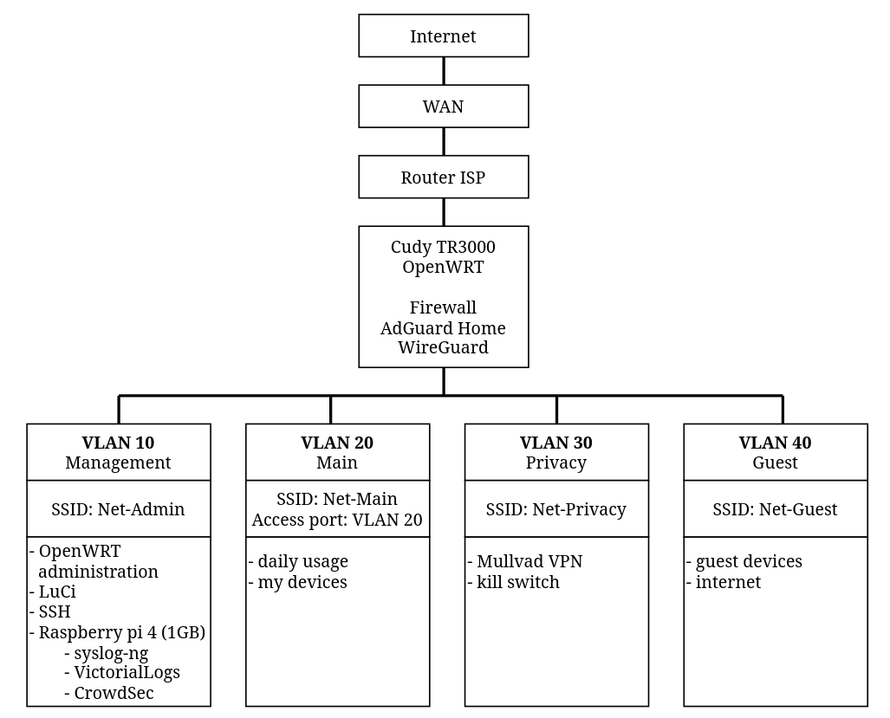

# Configuration Cudy TR3000 witch OpenWRT

1. Project Overview

Thist project presents the configuration of a Cudy TR3000 router running OpenWRT. I created it to separate my devices form the main home network and appy more restrictive security rules.

A Raspberry Pi 4 is also used as a lightweight security monitoring and logging server. It collect logs from OpenWRT, stores then centrally, and analyzes security events using syslog-ng, VictoriaLogs and CrowdSec.

2. Goals
- Network segmentation using four VLANs
- Isolation of high-risk or anonymized traffic
- Restricting communication between VLANs
- DNS encryption and blocking ads and tracers
- Secure remote access
- VPN routing with kill switch
- Creating a configuration that can be use daily

3. Hardware
- Router: Cudy TR3000
- Firmware: OpenWRT

- Raspberry pi 4 (1 GB) 
- Pendrive 64 GB

4. Network Architecture

The network divided info four VLANs. Each VLAN has a different purpose and is isolated the other networks by firewall rules.

## VLAN 10 - Managment
- OpenWRT administration
- Access to LuCi
- SSH access
- Management of future network infrastructure
- Security monitoring and centralized logging
- No access to other VLANs by default

## VLAN 20 - Main
- Daily network usage
- Personal and trusted devices
- Internet access
- No access to other VLANs
``
## VLAN 30 - Privacy
- Less trusted and privacy-focused traffic
- Mullvad or Proton VPN
- VPN kill switch
- No access to other VLANs

## VLAN 40 - Guest
- Guest devices
- Internet access only
- No access to internal network

5. Network Diagram

