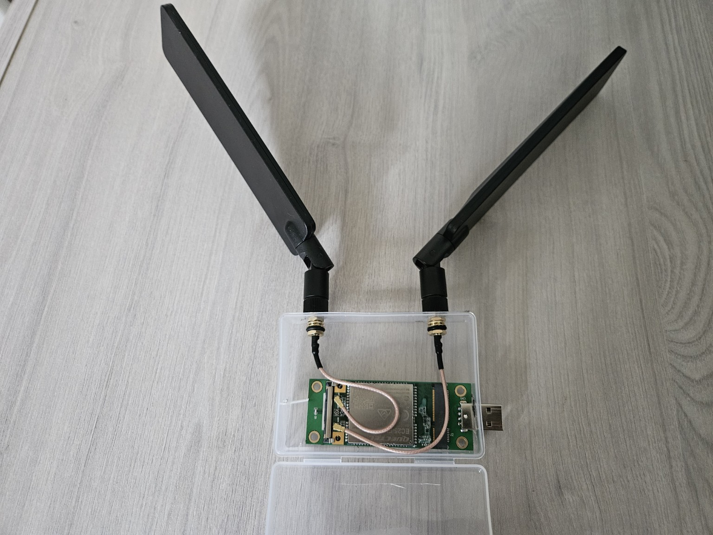

# LTE WWAN Configuration

## Goal

At first, I planned to connect the WAN port of the Cudy router to my main router using an Ethernet cable. However, due ti installation imitations, running the cable to the final location was not practical, so I decided to use LTE as the main internet connection.

I choose the Quectel EC25-EUX because it is well supported by OpenWRT and relatively easy to configure. My main goal was to have a stable and reliable internet connection. In the future, I also plan to test faster modems, even if they are more difficult to configure.

I also bought a mini-PCIe to USB-A adapter, two IPEX to SMA cables, and two external LTE antennas. I used a small plastic box as a prototype enclosure for the modem, adapter and antennas.

## Hardware
- Quectel EC25-EUX
- USB adapter
- SIM card
- 2 external LTE antennas
- IPEX to SMA cables

*Prototype LTE modem enclosure with Quectel EC25-EUX, USB adapter and external antennas.*


## Required Packages

Before configuring the modem, I installed the packages required for QMI support and communication with the Quectel EC25-EUX.

```bash
apk update
apk add kmod-usb-net-qmi-wwan
uqmi luci-proto-qmi
kmod-usb-serial-option picocom
```

## Modem detection

After installing the required packages, OpenWRT detected the modem and created the follow interface:
```
ttyUSB0
ttyUSB1
ttyUSB2
ttyUSB3
cdc-wdm0
wwan0
```

I verified QMI communication with:
```bash
uqmi -d /dev/cdc-wdm0 --get-capabilities
```

I also checked the SIM card and network registration:
```bash
uqmi -d /dev/cdc-wdm0 --uim-get-sim-state
iqmi -d /dev/cdc-wdm0 --get-serving-system
```

The SIM was detected correctly and the modem registered in the LTE network.

## LTE Interface Configuration

I created a new interface in LuCI using the following settings:
- Interface name: LTE
- Protocol: QMI Cellular
- Modem device: /dev/cdc-wdm0
- APN: internet
- Authentication: NONE
- PDP Type: IPv4
- Bring up on boot: Enabled
- Firewall zone: wan

## Connection Verification
I verified internet access directry through the LTE interface:
```bash
ping -I wwan0 -c 3 1.1.1.1
```

I also checked the routing table:
```bash
ip route
```

After confirming that LTE was working, I disconnected the temporary Ethernet WAN connection.

Internet access and DNS resolution continued to work through LTE.

## LTE Band Testing

I tested several LTE bands to find the best connection in my location.

The active band was checked using:
```bash
AT+QNWINFO
```

I tested:
- Band 1
- Band 3
- Band 7
- Bnad 20

Bnad 3 provided the best and most stable results.

Example Band 3 speed test:
```
Download: 28 Mb/s
Upload:   24 Mb/s
Ping:     22ms
```

I configured the modem to use Bnad 3:
```bash
AT+QCFG="band",0,4,0
```

## Final configuration

The final LTE WAN setup is:
```
   SIM Card
      |
Quectel EC25-EUX
      |
 Cudy TR3000
      |
    wwan0
      |
WAN firewall zone
      |
   internet
```

Final settings:
- Modem: Quectel EC25-EUX
- Protocol: QMI
- QMI device: /dev/cdc-wdm0
- Network interface: wwan0
- APN: internet
- IP Protocol: IPv4
- LTE Band: B3
- Firewall zone: wan


